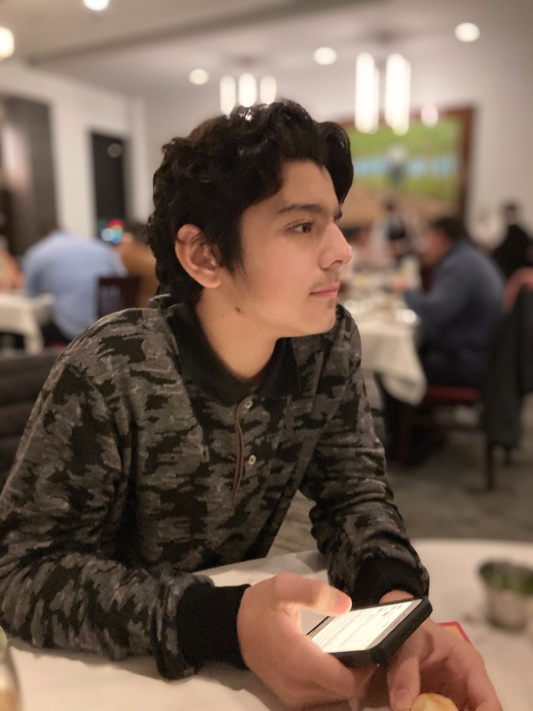

# Hi there 👋, I'm Tarek Ali - aka DGK 

    

## I'm a student, avid open source developer, and aspiring software engineer!

- I'm currenty working on a myriad of projects! ✋
- Trying to learn as much as I can as soon as possible! 😄
- Looking to collaborate with fellow developers; if you need help, @ me! 👌

## Connect with me

 
 

## Support me financially 🙏

 
 

## Languages and Tools

    
    
    
    
    
    
    
    
    
    
    
    
    
    
    
    
    
    
    
    
    
    
    
    
    
    
    

                                                                                                                                                        